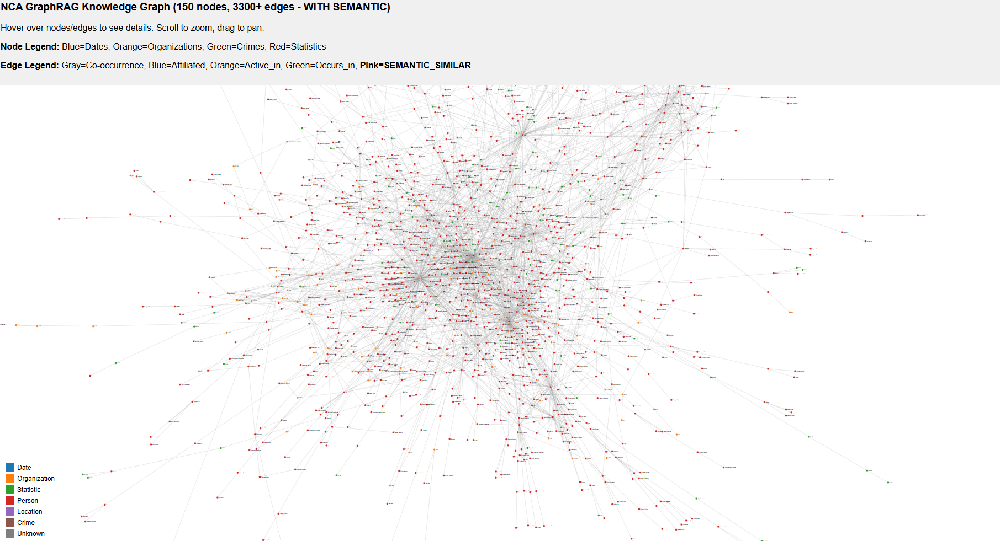
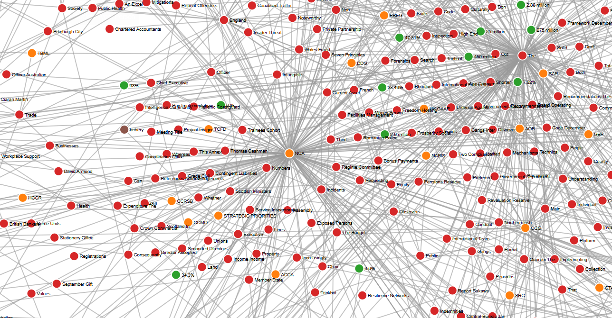
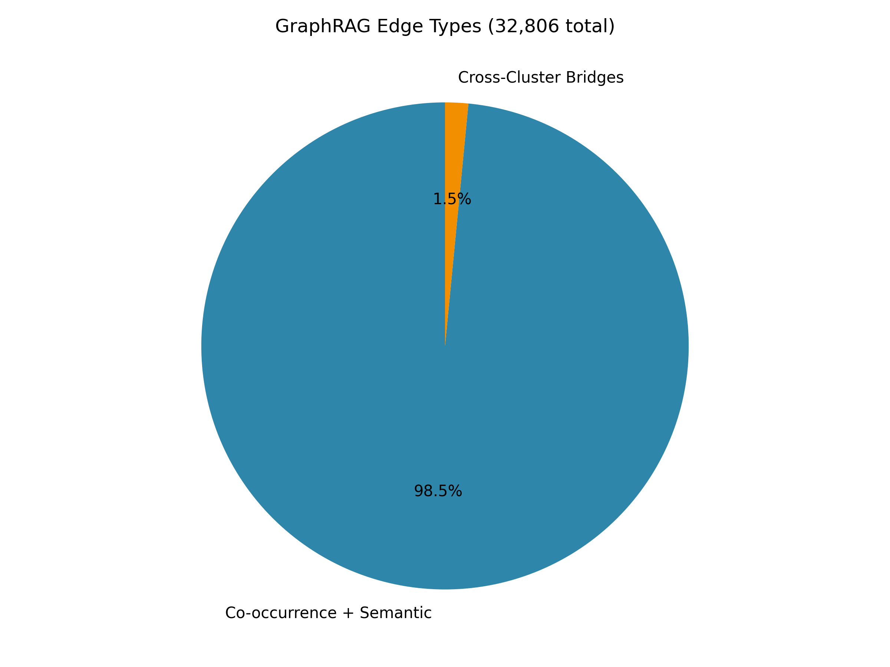

# GraphRAG vs RAG: Comparative Analysis on NCA Crime Data

A comparative analysis between Traditional RAG (Retrieval-Augmented Generation) and GraphRAG for global sensemaking tasks using UK National Crime Agency (NCA) documents.

## Overview

This project implements and compares two approaches for querying crime data:

- **Traditional RAG**: Vector database (ChromaDB) with dense retrieval
- **GraphRAG**: Knowledge graph with 10,417 nodes and 32,806 edges

Both pipelines use the same LLM (Mistral 7B), dataset (155 NCA PDFs, 1,529 chunks), and chunking strategy for fair comparison.

## Tech Stack

- **LLM**: Mistral 7B via Ollama
- **Embeddings**: all-MiniLM-L6-v2 (384 dimensions)
- **Vector Database**: ChromaDB
- **Graph**: NetworkX + D3.js visualization
- **Interface**: Streamlit

## Results Summary

### Evaluation Metrics (1-5 Scale)

| Pipeline | Relevance | Completeness | Grounding | Retrieval |
|----------|------------|--------------|-----------|------------|
| RAG      | 2.8        | 2.2          | 2.8       | 2.9        |
| GraphRAG | 1.9        | 1.7          | 1.7       | 1.9        |

### Response Time

Both pipelines average 7.2 seconds (LLM generation dominates runtime).

### Key Findings

**RAG outperformed GraphRAG** across all metrics. Analysis reveals:

- GraphRAG generated answers that ignored graph structure
- Hallucinations present in GraphRAG outputs (e.g., claiming trends not supported by data)
- RAG's direct chunk retrieval proved more reliable for this dataset size
- GraphRAG requires improved query-time integration for global sensemaking tasks

## Visualization

### Interactive Knowledge Graph (D3.js)

The project includes an interactive D3.js visualization of the GraphRAG knowledge graph (30% sample: 3,125 nodes, 3,300+ edges).



To view the interactive visualization:

```bash
cd visualization
python -m http.server 8080
```

Open: http://localhost:8080/graph_visualization.html

### GraphRAG Knowledge Graph Screenshot



### GraphRAG Edge Types:



### GraphRAG Knowledge Graph


## Project Structure

```
.
├── LaTeX/                          # IEEE Conference Paper
│   ├── main.tex                    # Paper with evaluation results
│   ├── references.bib
│   └── figures/                    # Generated graphs
├── visualization/                   # Interactive D3.js graph
│   └── graph_visualization.html
├── app_v2.py                      # Streamlit interface
├── evaluation_results.json         # 10 questions, both pipelines
├── requirements.txt
└── LICENSE
```

## Installation

```bash
pip install -r requirements.txt
ollama serve
ollama pull mistral
```

## Usage

### Run RAG Pipeline

```bash
python code/rag/scripts/rag_pipeline.py "Your question here"
```

### Run GraphRAG Pipeline

```bash
python code/rag/graphrag/scripts/graphrag_query_v2.py
```

### Launch Streamlit Interface

```bash
streamlit run code/rag/scripts/app_v2.py
```

Access at http://localhost:8501

## Dataset

- 155 NCA PDFs (2016-2026)
- Processed into 1,529 chunks (500 words/chunk, 50-word overlap)
- Includes Strategic Assessments, annual reports, and partnership documents

## GraphRAG Implementation

### Graph Construction (Rule-Based)

- **Entities**: Regex patterns (Dates: 20XX, Organizations: ALL-CAPS, People: Title Case)
- **Relationships**: Co-occurrence within 200 characters
- **Normalization**: 69,161 raw entities reduced to 10,417 unique nodes
- **Enhanced Edges**:
  - SEMANTIC_SIMILAR: ChromaDB embeddings, cosine > 0.75 (1,169 edges)
  - CROSS-CLUSTER_BRIDGE: K-Means cross-cluster connections (500 edges)
- **Community Detection**: Louvain algorithm (126 communities)

### Final Graph Statistics

- Nodes: 10,417
- Edges: 32,806
- Edge types: co-occurs_with, affiliated_with, active_in, occurs_in, reported_in, SEMANTIC_SIMILAR, CROSS-CLUSTER_BRIDGE

## Evaluation Framework

10 global sensemaking questions tested:

1. What are the main crime trends 2016-2023?
2. How does NCA collaborate with other organizations?
3. What is the statistical trend in human trafficking cases?
4. Which organizations are most active in drug trafficking?
5. Compare crime patterns in 2016 vs 2023
6. What are the key entities in NCA's operations?
7. How do crime types cluster together?
8. What are the top crime priorities for NCA?
9. Which entities bridge different crime domains?
10. Summarize NCA's strategic focus areas

## Improvements Needed for GraphRAG

1. Implement community-based summarization for global queries
2. Improve graph-to-text mapping
3. Add re-ranking of graph-retrieved context
4. Expand dataset (graph advantages emerge with larger datasets)

## References

- Edge et al. (2024). "From Local to Global: A GraphRAG Approach" [2404.16130]
- Zhu et al. (2025). "KG2RAG: Knowledge Graph-Guided RAG" [2502.06864]
- Lewis et al. (2020). "Retrieval-Augmented Generation for Knowledge-Intensive NLP Tasks"

## License

MIT License - see LICENSE file for details.
